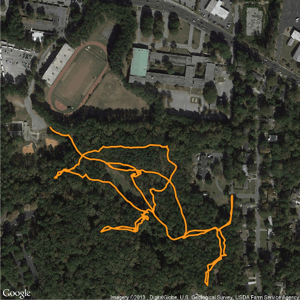

ggMAP
========================================================

Creation de cartes avec googlemap et openstreetmap


```r
gps <- read.csv("elwin.csv",header = TRUE)
head(gps)
```

```
##      No Latitude Longitude Altitude Heartrate Cadence       Date     Time
## 1 12022    33.82    -84.33    278.9         0      NA 2012/12/31 11:48:46
## 2 12023    33.82    -84.33    275.6         0      NA 2012/12/31 11:48:52
## 3 12024    33.82    -84.33    278.9         0      NA 2012/12/31 11:48:55
## 4 12025    33.82    -84.33    284.2         0      NA 2012/12/31 11:49:02
## 5 12026    33.82    -84.33    284.7         0      NA 2012/12/31 11:49:04
## 6 12027    33.82    -84.33    287.6         0      NA 2012/12/31 11:49:10
```

```r

library(ggmap)
```

```
## Loading required package: ggplot2
```

```r

mapImageData <- get_map(location = c(lon = mean(gps$Longitude),
lat = 33.824),
color = "color", # or bw
source = "google",
maptype = "satellite",
# api_key = "your_api_key", # only needed for source = "cloudmade"
zoom = 17)
```

```
## Map from URL : http://maps.googleapis.com/maps/api/staticmap?center=33.824,-84.325735&zoom=17&size=%20640x640&scale=%202&maptype=satellite&sensor=false
## Google Maps API Terms of Service : http://developers.google.com/maps/terms
```

```r
 
pathcolor <- "#F8971F"

ggmap(mapImageData,
extent = "device", # "panel" keeps in axes, etc.
ylab = "Latitude",
xlab = "Longitude",
legend = "right") +
geom_path(aes(x = Longitude, # path outline
y = Latitude),
data = gps,
colour = "black",
size = 2) +
geom_path(aes(x = Longitude, # path
y = Latitude),
colour = pathcolor,
data = gps,
size = 1.4) # +
```

 

```r
# labs(x = "Longitude",
# y = "Latitude") # if you do extent = "panel"

mapImageData <- get_map(location = c(lon = mean(gps$Longitude),
lat = 33.824),
color = "color", # or bw
source = "osm",
maptype = "",
zoom = 17)
```

```
## Map from URL : http://maps.googleapis.com/maps/api/staticmap?center=33.824,-84.325735&zoom=17&size=%20640x640&maptype=terrain&sensor=false
## Google Maps API Terms of Service : http://developers.google.com/maps/terms
```

```
## Warning: ouverture impossible : le statut HTTP était '403 Forbidden'
```

```
## Error: map grabbing failed - see details in ?get_openstreetmap.
```


